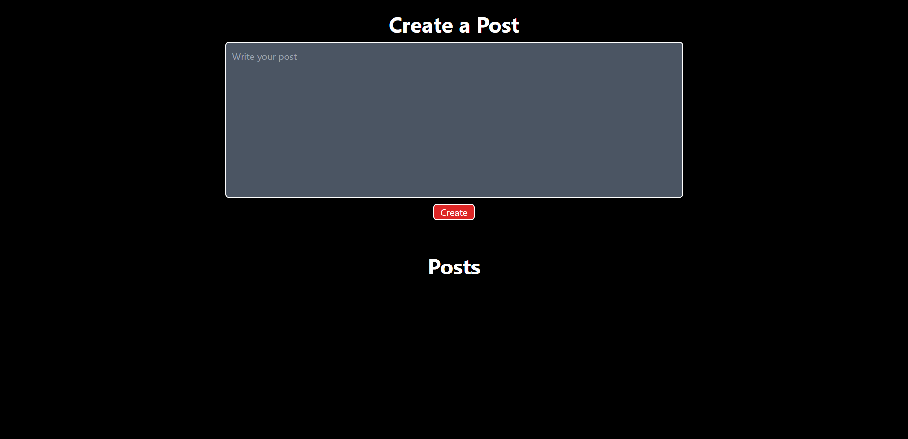
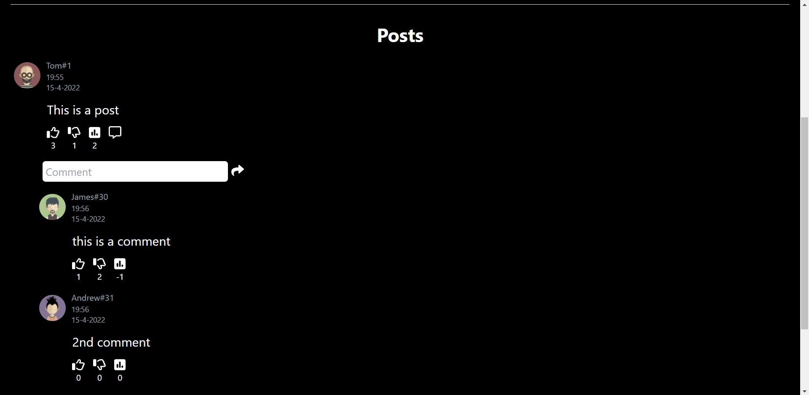

# Forum | ReactJS

Forum is a ReactJS based web app which runs only on frontend. Project related to Nirvana mentor plus internship assignment

## Table Of Contents

- [Overview](#overview)
  - [The Project](#the-project)
  - [Screenshot](#screenshot)
  - [Link](#link)
- [Development](#development)
  - [Tech Stack](#tech-stack)
- [Author](#author)

## Overview

### The Project

Forum app is capable of creating posts on the app which are stored using state variables. A random username from a list of names is assigned to the post. A user is allowed to upvote and downvote a post and also comment to a post. Replying to a comment is not allowed. A user can also give a upvote and downvote to a comment. Upvotes nd downvotes of both psotn and comment are stored using state variable. A image is lso assigned to the post and the comment using cartoon-avatar package. A net vote ounter is also visible on a post and a comment. 

### Screenshot

### Link

[Github Code](https://www.github.com/yash1699/forum-app)
[Live Site URL](https://yash1699.github.io/forum-app)

## Development

### Tech Stack

- HTML5 markup
- Tailwind CSS
- Javascript
- ReactJS Library

## Author

- GitHub - [@yash1699](https://github.com/yash1699)
- LinkedIn - [@yash-verma-5a84641a9](https://linkedin.com/in/yash-verma-5a84641a9)